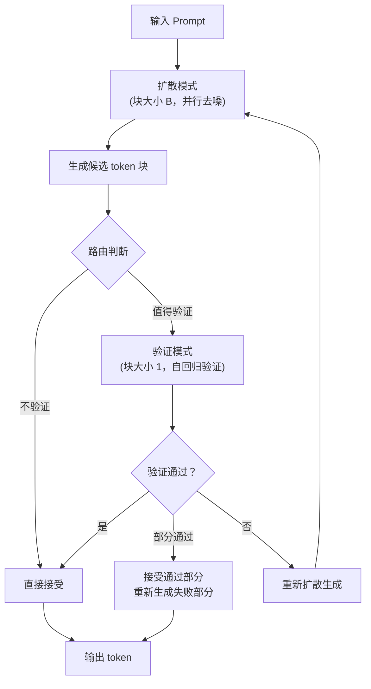

# S2D2：扩散语言模型的无训练加速解码

## 核心问题

扩散语言模型（Diffusion LLMs）承诺比自回归更快的生成速度——因为它们可以对 token 块进行并行去噪，而不是逐 token 串行生成。

但在实际的"少步"（few-step）机制下，标准的基于置信度阈值的解码方法表现得很脆弱：
- **激进的阈值**：提高加速比，但严重损害生成质量
- **保守的阈值**：保持质量，但需要不必要的去噪步骤，削弱加速效果

现有解决方案要么需要额外训练，要么会增加测试时计算开销。

## 核心洞察：块大小 = 1 时的自回归性质

S2D2 的关键观察：**当块大小（block size）降为 1 时,块扩散模型的生成过程退化为标准的自回归生成**。

这意味着：
- **同一个模型,两种模式**：
  - 块大小 N 大于 1：扩散模式（并行去噪,快）
  - 块大小等于 1：AR 模式（串行生成,准确）
- **无需额外训练**：这两种模式都是预训练模型已经学会的
- **理想的草稿器-验证器配对**：
  - 扩散模式作为草稿器（快速提出候选）
  - AR 模式作为验证器（严格验证质量）

## S2D2 框架详解

### 整体流程

**标准块扩散解码**：
- 对每个块进行并行去噪
- 输出块

**S2D2 解码**：
- **草稿阶段（扩散模式）**：并行去噪块内所有 token,生成候选 token 序列
- **验证阶段（AR 模式）**：如果路由策略决定验证,则逐 token 验证
  - 对每个候选 token 用 AR 模式验证
  - 如果接受:保留该 token
  - 如果拒绝:拒绝该 token 及后续所有 token
- **输出**：输出已验证的 token

### 验证机制

AR 模式作为"ground truth"验证器,因为它对序列的建模更准确。接受/拒绝标准基于概率对比:
- 如果 AR 模式下该 token 的概率大于扩散模式下的概率,则接受
- 否则拒绝该 token 及后续所有 token

**关键点**：一旦拒绝一个 token,后续所有 token 都被拒绝,因为它们的上下文已经不正确了。

### 轻量级路由策略

不是所有块都需要验证。路由策略决定何时验证值得其开销。

- **置信度阈值路由**：如果扩散模式对整个块的平均置信度大于阈值,跳过验证
- **熵路由**：高熵表示不确定,需要验证；低熵表示确定,跳过验证
- **混合策略**：结合多个指标（置信度、熵、上下文复杂度等）

"轻量级"的含义：路由决策的计算成本远小于验证本身的成本。

## 实验结果

### SDAR 模型上的表现

- **相比自回归解码**：加速比最高 **4.7 倍**,质量保持或略有提升
- **相比动态解码基线**：加速比最高 **1.57 倍**,准确率提升最高 **4.5 个百分点**

### LLaDA2.1-Mini 上的表现

- **保守设置下**：加速比 **4.4 倍**（相比静态基线）,准确率略高
- **与内置自我修正的协同**：S2D2 与 LLaDA 的自我修正机制互补,不是竞争关系,而是可以叠加使用

### 跨模型一致性

三个主流块扩散模型家族（SDAR、LLaDA、第三个家族）都获得了普遍改进,证明 S2D2 的方法具有强泛化性。

## 为什么值得关注

### 创新亮点

1. **简洁优雅的核心思想**
   - 块大小作为控制变量:一个参数切换两种模式,无需架构修改
   - 自回归验证:利用 AR 模式作为 ground truth,理论扎实
   - 无需训练:直接使用预训练模型,零额外成本

2. **显著的加速效果**
   - 4.7 倍相比 AR:在 SDAR 上的最佳结果
   - 1.57 倍相比动态解码:且质量更好
   - 跨模型一致性:三个家族都受益

3. **质量保证**
   - 不牺牲质量:甚至在某些设置下提升质量
   - AR 模式作为安全网:保证生成质量不会低于纯 AR
   - 自适应验证:只在需要时验证,避免过度修正

4. **工程友好**
   - 即插即用:无需重新训练、微调
   - 轻量级路由:决策开销可忽略
   - 易于实现:核心算法逻辑简单

### 潜在局限

1. **扩散模型的依赖性**
   - 只适用于块扩散模型:传统 AR 模型无法使用
   - 需要块大小可调:某些扩散模型可能不支持
   - 扩散模型本身还不够成熟:生态和工具链不如 AR 完善

2. **验证开销的现实性**
   - AR 验证不是免费的:虽然比纯 AR 快,但仍有成本
   - 早期拒绝的假设:如果验证经常需要跑完整个块,优势减弱

3. **路由策略的调优**
   - 需要调参:路由阈值可能需要根据任务/模型调整
   - 数据依赖:最优策略可能在不同数据分布上不同

## 更深层的思考

S2D2 的"快速草稿 + 严格验证"模式与人类认知过程惊人地相似。

**人类写作**:
- 第一遍:快速写下想法（草稿）
- 修改:逐句检查、修正错误（验证）

**人类对话**:
- 快速回应:直觉性回答
- 自我纠正:察觉错误后修正

这提醒我们:**在追求更大更强的模型时,也不要忽视对现有模型能力的深度挖掘**。有时候最好的解决方案不是增加复杂度,而是发现已有组件的新用法。

## 延伸应用

S2D2 的核心思想可以推广到:

- **图像生成**:低分辨率快速生成 + 局部超分辨率验证
- **语音合成**:快速生成音频帧 + 关键帧验证
- **代码生成**:快速生成代码块 + 关键位置验证 + 静态分析

这个框架展示了一个更普遍的范式:在几乎所有的生成任务中,都存在"快速但可能错误"和"慢但准确"的两种模式。关键在于如何智能地结合它们。

*参考论文:S2D2: Fast Decoding for Diffusion LLMs via Training-Free Self-Speculation (arXiv:2603.25702)*

