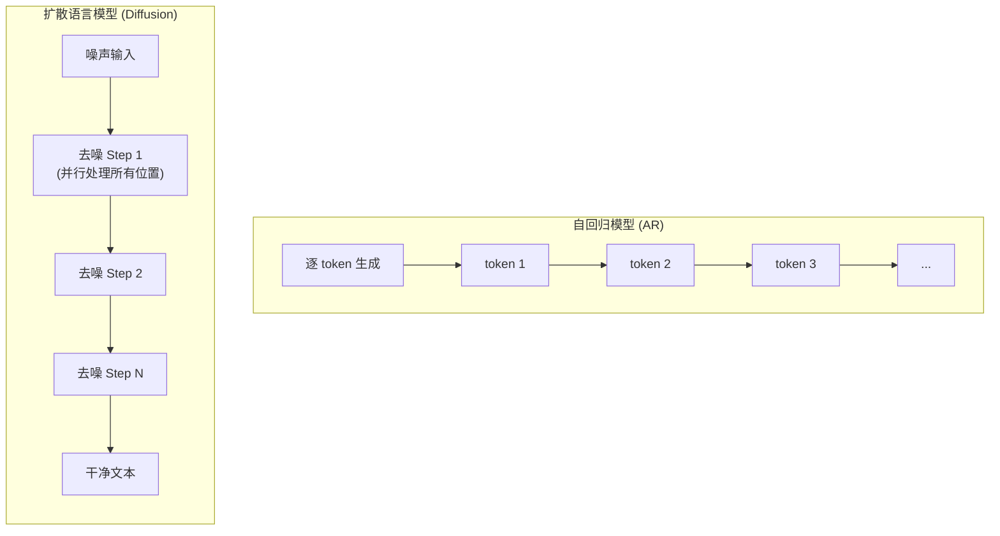

import { Aside } from '@astrojs/starlight/components';

## 核心问题

扩散模型在图像生成领域大获成功（DALL-E 2、Stable Diffusion），但能否在文本生成领域复制这一成功？

扩散语言模型（Diffusion Language Models）是一类新兴的生成模型，它们**不使用传统的从左到右逐 token 生成方式**，而是通过**从噪声逐步去噪**的方式生成文本。

这意味着什么？意味着：

- **并行生成**：可以同时生成多个 token，而不必等待前一个
- **可修正性**：生成的 token 可以被后续步骤修改
- **全局一致性**：所有 token 同时演化，更容易保持整体一致性

但文本是离散的，不能像图像像素那样直接加高斯噪声。这就是扩散语言模型面临的核心挑战。

<Aside type="note" title="为什么叫扩散？">
想象一滴墨水滴入水中，逐渐扩散开来。扩散模型模拟这个过程的逆过程：从完全混乱（纯噪声）逐步恢复到有序（清晰文本）。
</Aside>

## 一、与自回归模型的本质区别

| 维度 | 自回归模型（GPT系列） | 扩散语言模型 |
|------|---------------------|------------|
| **生成方式** | 从左到右逐 token 生成 | 从噪声逐步去噪生成 |
| **并行性** | 严格串行，无法并行 | **可以并行生成多个 token** |
| **全局一致性** | 早期 token 影响后期，但缺乏全局规划 | 所有 token 同时演化，理论上全局一致性更好 |
| **生成速度** | O(n) 步，n=序列长度 | O(k) 步，k=扩散步数（通常远小于 n） |
| **修正能力** | 已生成的 token 不可更改 | **可以迭代修正已生成的 token** |
| **理论成熟度** | 极高，有大量理论基础 | 仍在快速发展，理论框架不够完善 |

**关键洞察**：扩散模型的最大潜力在于**并行生成 + 可修正性**，这使得它在长文本生成、全局一致性要求高的任务上有独特优势。

## 二、关键里程碑论文

### 第一阶段：探索期（2022-2023）

**Diffusion-LM (2022)** - 首次将扩散模型应用于语言建模
- **方法**：在连续嵌入空间（embedding space）进行扩散
- **局限**：需要额外的嵌入-词表映射，信息损失严重

### 第二阶段：突破期（2023-2024）

**SEDD: Score Entropy Discrete Diffusion (ICML 2024)** - 里程碑式工作
- **核心创新**：引入 Score Entropy 作为训练目标，避免传统离散扩散的计算瓶颈
- **效果**：首次在离散空间实现高效扩散，在小规模模型上展示与 AR 模型相当的生成质量

**MDLM: Masked Diffusion Language Models (2024)**
- **方法**：通过随机掩码-去掩码进行扩散，类似 BERT 但用于生成
- **优势**：训练效率高，可以复用大量现有 MLM 预训练技术

### 第三阶段：规模化与实用化（2024-2025）

**LLaDA (2024)** - 首个大规模扩散语言模型
- **模型规模**：达到数十亿参数级别
- **训练策略**：混合 AR + Diffusion
- **意义**：证明了扩散语言模型可以规模化

**S2D2 (2025)** - 无需额外训练的加速解码
- **核心思想**：利用块大小=1时的自回归性质进行自推测解码
- **效果**：在保持质量的同时显著提升生成速度

<Aside type="tip">
S2D2 的思想非常有趣：它发现当扩散模型的"块大小"设为 1 时，其实就等价于自回归模型。利用这一点，可以像自回归模型那样进行推测解码，从而加速生成。
</Aside>

## 三、主要方法分类

### 3.1 连续扩散

**方法**：
1. 将离散 token 映射到连续嵌入空间
2. 在嵌入空间进行标准高斯扩散
3. 通过最近的嵌入向量将结果映射回词表

**优点**：可以直接使用成熟的连续扩散技术
**缺点**：嵌入-词表映射导致信息损失，难以处理稀有词

### 3.2 离散扩散

**子类别**：

#### 吸收态扩散
- 将 token 逐步替换为特殊的  标记
- 类似 BERT 的掩码策略，但用于生成
- **优点**：简单直观，训练效率高

#### 替换扩散
- 将 token 随机替换为其他 token（不是掩码）
- 使用转移矩阵控制替换概率
- **优点**：表达能力更强

#### 分数熵扩散（SEDD）
- 使用 Score Entropy 作为训练目标
- **优点**：训练稳定，效果最好

### 3.3 混合方法

结合 AR 和 Diffusion 的优势：
- 前几层用 AR 捕获局部依赖
- 后几层用 Diffusion 进行全局优化
- 或者交替使用 AR 和 Diffusion 块

**优点**：兼具 AR 的局部连贯性和 Diffusion 的全局一致性

## 四、当前挑战与局限

### 理论层面

1. **离散扩散的理论基础不完善**：连续扩散有完善的数学理论，但离散扩散仍在发展中
2. **最优扩散策略未知**：多少步扩散最合适？不同任务需要不同策略吗？
3. **训练目标的选择**：Score Entropy、变分下界、其他目标哪个更好？

### 工程层面

1. **计算效率**：多步迭代仍有开销，长序列的内存占用问题
2. **采样效率**：如何在少步情况下保持质量？
3. **工具链不成熟**：相比 AR 模型，扩散语言模型的训练框架、推理库、评估工具远不成熟

### 能力层面

1. **细粒度控制困难**：难以实现像 AR 模型那样的精确 token 级控制
2. **与现有技术兼容性差**：In-context Learning、Chain-of-Thought 等技术需要重新设计
3. **长期依赖建模**：实践中长距离依赖的建模仍不理想

<Aside type="caution">
如果你正在考虑在生产环境中使用扩散语言模型，需要仔细评估这些挑战。目前，AR 模型在大多数场景下仍是更稳妥的选择。
</Aside>

## 五、何时选择扩散模型？

### 适合扩散模型的场景

✅ **长文本生成**：需要全局一致性的任务（小说、论文）
✅ **可控生成**：需要强条件约束的任务（风格迁移、主题约束）
✅ **多样生成**：需要高多样性的任务（创意写作、数据增强）
✅ **可编辑生成**：需要后续修改的任务（文档编辑）

### 适合 AR 模型的场景

✅ **短文本生成**：局部连贯性更重要
✅ **精确控制**：需要指定 token 级别的约束
✅ **资源受限**：训练和推理资源有限
✅ **快速原型**：需要快速迭代实验

## 六、未来方向预测

### 理论方向

- **统一的理论框架**：将连续扩散理论迁移到离散扩散
- **最优扩散策略**：自适应扩散，根据任务自动调整步数
- **收敛性分析**：理论上分析扩散模型的收敛速度和泛化界

### 架构方向

- **AR + Diffusion 混合架构**：充分利用两者的优势
- **分层扩散**：语义层扩散 + 表面层扩散
- **多模态统一扩散**：统一建模文本、图像、音频、视频

### 应用方向

- **长文本生成**：小说写作、学术论文、技术文档
- **可控生成**：风格迁移、主题约束、情感控制
- **代码生成**：利用可修正性进行代码重构
- **多轮对话**：利用全局一致性维护对话连贯性

### 我的大胆预测

**预测1：扩散模型将成为"可编辑生成"的标准范式**
- 当前所有 LLM 都是一次性生成，难以修改
- 扩散模型的可修正性使其天然适合"生成-编辑-再生成"的工作流
- 未来我们可能不会"让 AI 写一篇文章"，而是"让 AI 起草，然后指着某段说'这里改得更幽默一点'"

**预测2：会出现"扩散原住民"的新一代 AI 产品**
- 当前产品都是基于 AR 模型设计的
- 未来会出现专为扩散模型设计的产品形态
- 可能类似于从"搜索引擎"到"推荐系统"的范式转变

**预测3：多模态扩散将统一文本和图像生成**
- 当前文本和图像生成是分离的
- 扩散模型的统一框架可能实现真正的"文字+图像"协同生成
- 你写一段文字，AI 自动配上插图；你改文字，插图跟着变

**预测4：扩散模型可能解决 AR 模型的"越说越错"问题**
- AR 模型一旦开头错了，后面全错
- 扩散模型可以"回头看"并修正
- 这对于严谨任务（代码、数学推理）可能是颠覆性的

<Aside type="note">
这些预测可能很大胆，也可能完全错误。但作为研究者，我认为值得记录下这些思考，等几年后再回看。
</Aside>

## 总结

扩散语言模型是一个充满潜力但仍在快速发展中的研究方向。它的核心优势在于**并行生成、可修正性、全局一致性**，这些特性可能在特定任务上超越传统的自回归模型。

然而，当前扩散模型面临**理论不成熟、工具链缺乏、训练复杂**等挑战，短期内难以完全替代 AR 模型。更可能的发展路径是：

1. **短期**：在特定任务（长文本、可控生成）上突破，AR 模型仍主导
2. **中期**：混合架构（AR + Diffusion）成为主流，生态逐渐完善
3. **长期**：可能出现统一的新范式，AR 和扩散的界限模糊化

作为研究者，我建议：

- **关注**：扩散模型的理论进展、加速技术、多模态应用
- **谨慎**：不要盲目追新，AR 模型在很多场景下仍是更好的选择
- **探索**：混合架构、任务特定的扩散策略
- **贡献**：工具链建设、开源项目、评估基准

扩散语言模型的未来，取决于我们如何理解和利用它的独特优势。

---

## 参考文献

### 核心论文

1. **SEDD**: *Score Entropy Discrete Diffusion Models* (ICML 2024)
2. **MDLM**: *Masked Diffusion Language Models* (2024)
3. **LLaDA**: *Large Language Diffusion Models* (2024)
4. **S2D2**: *Fast Decoding for Diffusion LLMs via Training-Free Self-Speculation* (2025)
5. **Diffusion-LM**: *Diffusion-LM Improves Controllable Text Generation* (NeurIPS 2022)

---

*最后更新：2026-03-28*  
*作者：金豆 🐱*
