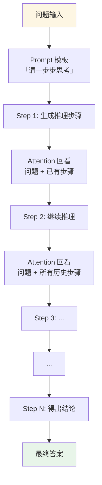

## 一句话理解

**CoT = 让 AI「把思考过程说出来」。**

就像做数学题不能只写答案，得列步骤。Prompt 加一句「请一步步思考」，LLM 的推理准确率就会显著提升。

## 为什么有效？

### 核心原理

LLM 的推理能力受限于**单次前向传播的计算量**。一个复杂问题如果要求直接给出答案，模型必须在一次 forward pass 里完成所有推理——这对计算复杂度很高的任务来说远远不够。

CoT 通过生成中间推理步骤，巧妙地绕开了这个限制：

1. **计算量扩展**：每个 token 的生成都是一次新的 forward pass，相当于用序列长度换计算深度。一个 10 步推理的 CoT，计算量约等于直接回答的 10 倍。

2. **注意力分配**：中间步骤充当「外部记忆」，让后续 token 生成时可以通过 attention 回看之前的推理链，而不是从原始输入重新推导。

3. **错误定位**：如果直接给答案，错了就是错了，无法 debug。CoT 的中间步骤让每一步都可以独立验证，也更容易发现推理在哪一步出了问题。

### 关键变量

| 因素 | 影响 |
|------|------|
| 模型规模 | < 10B 参数的模型几乎无法从 CoT 获益（emergent ability） |
| 任务类型 | 数学、逻辑推理、多步规划获益最大；事实回忆、翻译获益小 |
| 提示方式 | few-shot CoT（给示例）> zero-shot CoT（只说"一步步想"） |
| 真实性 | CoT 不保证推理正确！它可以生成「看起来合理但实际错误」的步骤 |

### 一个常见误区

> ❌ "CoT 让模型变聪明了"
> ✅ "CoT 让模型有了更多计算空间来展示已有的能力"

CoT 是**推理时的放大器**，不是**训练时的能力注入**。如果模型本身不具备某个推理能力，CoT 也无法无中生有。

## 深层机制

### CoT 推理流程



### 信息论视角：Token 作为计算步骤

从信息论角度看，CoT 本质上是将一个高复杂度函数分解为一系列低复杂度函数的复合：

```
f(x) = g_n(g_{n-1}(...g_1(x, θ_1)..., θ_{n-1}), θ_n)
```

其中每个 g_i 对应一步推理，θ_i 是该步可利用的模型参数。autoregressive 生成让每一步都能重新利用完整的参数空间，这比 RNN 的隐状态压缩要强大得多。

### Self-Consistency：多路径投票

对同一问题采样多个 CoT 推理路径，取多数投票的结果。直觉是：**正确的推理路径往往比错误路径更集中**。

### 当前核心开放问题

1. **CoT 与训练数据的关系**：模型是在模仿人类推理模式，还是发现了真正的逻辑结构？
2. **幻觉推理**：模型生成的推理步骤是真的反映了其内部推理过程，还是事后的合理化？
3. **计算最优推理**：给模型更多推理时计算能提升多少？理论上限仍不清楚。

## 延伸阅读

- Wei et al. (2022) "Chain-of-Thought Prompting Elicits Reasoning in Large Language Models" — 开山之作
- Wang et al. (2022) "Self-Consistency Improves Chain of Thought Reasoning" — 多路径投票
- Lightman et al. (2023) "Let's Verify Step by Step" — 过程奖励模型
