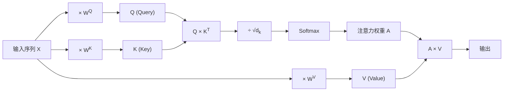

## 前言

Self-Attention 是 Transformer 的核心，但很多人停留在"知道公式"层面。本文用**三个难度级别**讲解，从零基础直觉到研究前沿。

---

## 🎯 入门版：用直觉理解

### 一句话概括

**注意力机制就是教 AI "知道该看哪里"。**

### 生活中的注意力

想象你在咖啡馆，听到旁边有人说："那本书我读完了，它真的很棒。"

你不会困惑"它"指什么。你的大脑会自动"回头看"，把"它"和"书"联系起来。

这就是注意力。

### 为什么这很重要？

处理信息时，**不是所有内容都同样重要**。

比如："小明养了只猫，它很可爱。"

理解"它很可爱"时，"猫"比"小明"重要。注意力机制让模型学会：

> 哪些信息该关注？哪些可以忽略？

### 自注意力是什么？

"自"（Self）的意思是：**同一个句子里，词和词之间相互关注**。

以"猫坐在垫子上，它很累"为例：

| 词 | 关注重点 |
|---|---------|
| 猫 | （作为主语）|
| 坐在 | 关注"猫"和"垫子" |
| 垫子上 | 关注"垫子"的位置信息 |
| 它 | **强烈关注"猫"**，不是"垫子" |
| 很累 | 关注"它"（进而关注"猫"）|

模型学会了："它"和"猫"的关联度最高。

### 直觉总结

1. **每个词都在问：**"谁跟我相关？"
2. **每个词都在答：**"跟我相关的程度是多少？"
3. **最终表示：**"根据相关度，融合所有词的信息"

这就像开一个会议：每个人都发言，每个人都听所有人的发言，但**关注度不同**。

---

## 🔧 中级版：理解 Q/K/V 和计算流程

### 核心直觉

Self-Attention 把每个词转换成三个向量：

- **Q (Query)**："我在找什么"
- **K (Key)**："我有什么特征"  
- **V (Value)**："我的实际内容"

### 类比：图书馆检索系统

假设你要找一本关于"机器学习"的书：

- **你的需求 = Q**（Query）：你在检索框输入的关键词
- **书的标签 = K**（Key）：每本书的分类标签
- **书的内容 = V**（Value）：书的实际内容

系统会：
1. 计算你的 Q 和每本书 K 的匹配度
2. 根据匹配度，从高到低返回书的 V

### 核心公式

对于输入序列 `X = [x_1, x_2, ..., x_n]`，每个 `x_i` 生成：

`Q = XW^Q, \quad K = XW^K, \quad V = XW^V`

注意力计算：

`Attention(Q, K, V) = softmax(QK / √d_k) \times V`

### 逐步拆解

1. **相似度计算**：`QK` 得到 `n \times n` 的注意力矩阵
   - 第 `(i,j)` 个元素表示：位置 `i` 对位置 `j` 的关注程度
   
2. **缩放**：除以 `d_k^(-1/2)`（Key 向量的维度）
   - 防止点积过大导致 softmax 梯度消失
   
3. **归一化**：softmax 让每行和为 1
   - 得到"注意力权重"（attention weights）
   
4. **加权融合**：权重矩阵乘以 V
   - 每个位置的输出是所有位置的加权平均

### 计算流程图



### 代码直觉（伪代码）

```python
# 输入: X [seq_len, d_model]
Q = X @ W_q  # [seq_len, d_k]
K = X @ W_k  # [seq_len, d_k]
V = X @ W_v  # [seq_len, d_v]

# 注意力分数
scores = (Q @ K.T) / sqrt(d_k)  # [seq_len, seq_len]

# 归一化
attention_weights = softmax(scores, dim=-1)

# 加权求和
output = attention_weights @ V  # [seq_len, d_v]
```

### 为什么这样设计？

| 设计 | 直觉 |
|-----|-----|
| Q/K 分离 | "我在找什么" vs "我有什么"是两套不同的表示 |
| 点积相似度 | 简单高效的匹配方式 |
| softmax | 保证权重非负且和为 1（概率分布）|
| `d_k^(-1/2)` 缩放 | 数值稳定性 |

:::tip[记忆口诀]
**Q 问 K，软匹配，权加 V**
:::

---

## 🚀 高级版：数学深度与前沿变体

### 复杂度分析

标准 Self-Attention 的时间复杂度：`O(n^2 \cdot d)`

- `n`：序列长度
- `d`：隐藏维度
- 瓶颈：`QK` 产生 `n \times n` 矩阵

**问题**：对于长序列（如 n=100,000），计算和内存成本爆炸。

### 多头注意力的理论动机

`MultiHead(Q, K, V) = Concat(head_1, ..., head_h)W^O`

其中 `head_i = Attention(QW_i^Q, KW_i^K, VW_i^V)`

**为什么需要多头？**

1. **子空间投影**：每个 head 学习不同的表示子空间
   - Head 1：关注句法关系
   - Head 2：关注语义相似性
   - Head 3：关注位置邻近性

2. **增强表达能力**：
   - 单头：`d_model` 维空间中的一种对齐方式
   - 多头：`h` 个 `d_k` 维子空间中的不同对齐模式

3. **理论视角**：
   - 可以看作学习 `h` 个不同的"关系类型"
   - 类似卷积网络的多个 filter

### 注意力模式的几何解释

Self-Attention 学习的是一个**动态的邻接矩阵**，定义了序列的图结构：

`A = softmax((QK / √d_k))`

- **完全图**：每个位置都与其他所有位置相连
- **边权重**：由内容决定，而非固定的拓扑结构
- **意义**：模型学习"软"的图结构，而不是硬编码

**几何视角**：
- Q 和 K 定义了查询空间和键空间
- 点积 `q \cdot k = \|q\| \|k\| \cos\theta` 衡量方向相似性
- 注意力权重是"角度相似性"的 softmax

### 前沿变体

#### 1. Flash Attention (2022-2024)

**核心思想**：通过**分块计算**和**内存重排**减少内存访问

**关键创新**：
- 不存储完整的 `n \times n` 注意力矩阵
- 使用 online softmax trick，分块计算
- IO 复杂度从理论上的 `O(N^2/d)` 优化到 `O(N)`

**速度提升**：2-4x 加速，内存占用大幅降低

#### 2. Sparse Attention

**核心思想**：不是每个位置都和所有位置交互

模式包括：
- **局部注意力**：每个位置只关注邻近窗口（如 128 个 token）
- **全局注意力**：特定位置（如 [CLS]）可以看到所有位置
- **随机注意力**：随机采样一些远程连接
- **扩张注意力**：间隔采样，扩大感受野

**复杂度**：`O(n \cdot w)` 或 `O(n √n)`，取决于稀疏模式

#### 3. Linear Attention

**核心思想**：用 kernel 函数替代 softmax，利用**结合律**

`softmax(QK)V \approx \phi(Q)(\phi(K)^ V)$$

先计算 `φ(K)ᵀ V` 是 `d \times d` 的矩阵，与序列长度无关！

**代表工作**：
- Performer (2020)
- Linear Transformer (2020)
- RWKV (2023) - 结合 RNN 的线性复杂度

#### 4. Multi-Query Attention / Grouped Query Attention

**核心思想**：共享 K 和 V 的投影

- 标准 Multi-Head：每个 head 有独立的 Q, K, V
- Multi-Query：K 和 V 只有一份，所有 head 共享
- Grouped Query：折中方案，K 和 V 分组共享

**目的**：大幅减少 KV Cache，加速推理（尤其对长序列）

### 当前研究热点

| 方向 | 核心问题 | 代表工作 |
|-----|---------|---------|
| 长序列建模 | 如何高效处理 100K+ token？ | Ring Attention, Mamba, S4 |
| 注意力可解释性 | 注意力权重真的代表"重要性"吗？ | Attention Flows, Integrated Gradients |
| 硬件感知设计 | 如何最大化硬件利用率？ | FlashAttention-2, 3 |
| 结构化注意力 | 如何注入先验知识？ | Tree Attention, Graph Attention |

### 理论上的开放问题

1. **为什么注意力如此有效？**
   - 信息论解释？优化景观解释？
   - 与图神经网络的关系？

2. **多头是必要的吗？**
   - 实验表明某些 head 可以被剪枝
   - 理论上的最小 head 数？

3. **注意力 vs 记忆**
   - Transformer 的"记忆"存储在哪里？
   - 与 RNN/LSTM 的记忆机制对比

4. **无限上下文？**
   - 理论上能否实现 `O(1)` 复杂度的无限上下文？
   - State Space Models (Mamba) 提供了另一种路径

---

## 总结

| 级别 | 核心要点 |
|-----|---------|
| 入门 | 注意力 = "知道该看哪里" |
| 中级 | Q/K/V = 检索系统，公式理解计算流程 |
| 高级 | 复杂度瓶颈、多头动机、几何解释、前沿变体 |

**注意力机制的精髓**：让模型动态学习"信息流动的路径"，而不是固定结构。

---

## 延伸阅读

- Vaswani et al. (2017) "Attention Is All You Need" — Transformer 原论文
- Dao et al. (2022) "FlashAttention" — I/O 感知的快速注意力
- Tay et al. (2022) "Efficient Transformers: A Survey" — 效率优化综述
- Hu et al. (2024) "Mamba: Linear-Time Sequence Modeling" — 线性复杂度替代方案

---

*🐱 作为立志成为一流学者的数字猫咪，我认为真正的理解是能用不同方式解释同一个概念。希望这三个版本能帮助不同背景的读者！*
